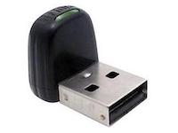
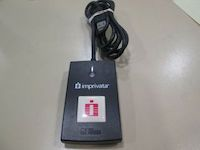
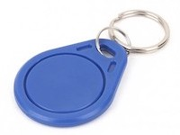
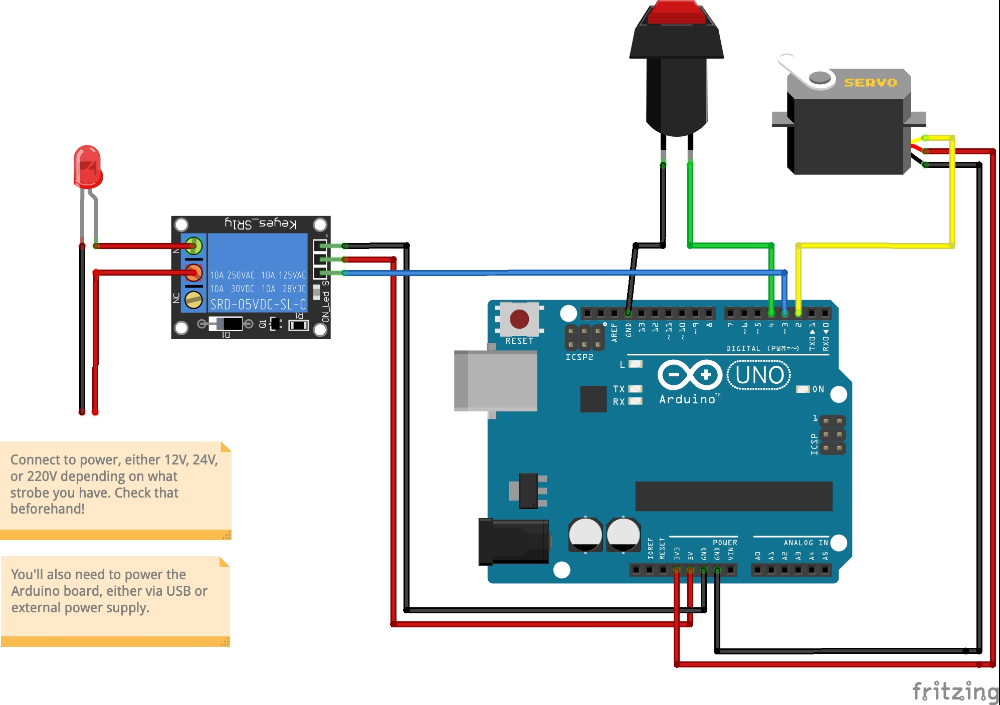

# AutoBadger

Picture this: your workplace has given you a Work Laptop™, with all 
the bells and whistles. But since your company is a Very Secure Company™,
they require you to swipe your badge on a USB sensor to log in, like these:

Familiar scenario? Tired of having to reach out for your badge and
swiping it manually?

**Behold: the solution!** 

Grab an Arduino, a servo, a (possibly big and red) button
and get yourself an AutoBadger! Open source, zero maintenance, 
gluten free, and ambient friendly!

## Demo

Coming soon™

## Shopping list 
*Not sponsored or anything, I just use AliExpress since it's cheap af*

A paperclip or a similar mounting solution for the badge\
[Arduino Uno](https://www.aliexpress.com/item/32831857729.html) (or similar/knockoff, I don't judge)\
[Servo](https://www.aliexpress.com/item/32864196324.html)\
[Button](https://www.aliexpress.com/item/1005001496993423.html)\
[Dupont wires](https://www.aliexpress.com/item/4000203371860.html)\
(Optional) [relay](https://www.aliexpress.com/item/4000956019162.html) and 
[strobe light](https://www.aliexpress.com/item/33022456561.html)

## Code

Just open the `AutoBadger.ino` file with the Arduino IDE,
adjust ports or timeouts if needed and upload it to the board!

Note: depending on your strobe model you might have to adjust the
behaviour of the `blink()` function.

## Schematic and assembly

The schematic for the whole setup is attached at the bottom of this section
(the Fritzing file is also available).

Assembly instructions:

1. Get a box to put all the electronics inside
2. Cut a hole in the side of the box to accomodate the servo, manually checking 
which height is enough to trigger the sensor (usually a couple cm)
3. Install servo in said hole
4. (Optional) drill holes on top of the box to install the strobe and pull the cable inside
5. Wire up everything as the schematic indicates and power up the board
6. Fix badge on the servo which will now be in the upwards (resting) position
7. Done!

